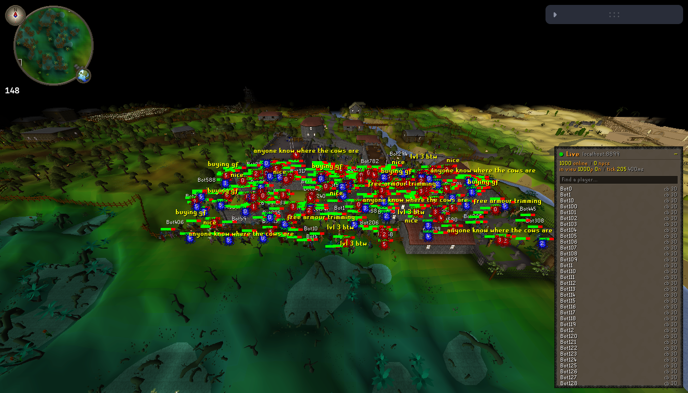

# Design: a live osrs.world for rs-sdk

rs-map-viewer (osrs.world) renders a RuneScape cache in WebGL2: terrain, locs and a static list of npc
spawns that wander at random. RS World keeps that renderer and swaps the static spawns for the live
world. The engine streams every player and npc in view, and the viewer simulates and draws them the
way the game client does.

```
 rs-sdk engine (tick thread)                            rs-world (browser)
 ───────────────────────────                            ──────────────────
 World.cycle()                                          WorldFeedClient  ws, reconnect, area sub
   processInfo()        masks, steps, anims set           │ tick / roster JSON
   processClientsOut()                                     ▼
   cycleWorldFeed() ──── /worldfeed (JSON over ws) ──►  LiveWorld        port of the webclient's
   processCleanup()     masks reset                       │                entity simulation
                                                          ▼  per 20ms cycle: route, facing, anims
 data/pack/main_file_cache.*  ── yarn sync-cache ──►    caches/rs-sdk-289  (same rev-289 cache)
                                                          │
                                   render worker pool ◄───┤  bake (model, seq) → frame geometry
                                                          ▼
                                                    LiveEntityRenderer   WebGL multi-draw per page
                                                    LiveOverlay          names, chat, hitsplats
                                                    LivePanel / WorldMap roster, follow
```

There are two pieces:

- **Engine feed**: `server/engine/src/web/worldfeed.ts` in rs-sdk, about 600 lines, off unless
  `WORLD_FEED=true`.
- **Live layer**: `src/live/` in this repo, plus small hooks in the viewer.

## 1. The engine feed

### Where it hooks

`cycleWorldFeed()` runs once per tick in `World.cycle()`, after `processClientsOut()` and before
`processCleanup()`. At that point everything the game client is told this tick is still on the
entities:

- the info masks (anim, spotanim, face, damage, say, chat, exact move, appearance, change type);
- `walkDir`/`runDir`/`tele`/`jump`;
- `lastTickX/Z`, the tile the entity started the tick on.

The feed only reads them, never changes game state, and catches its own errors.

### Protocol (v1, JSON text frames)

```
client → {t:'sub', x, z, w, h}        stream tiles [x, x+w) × [z, z+h), all levels (≤ 384×384)
client → {t:'roster', on}             every online player, every 5 ticks
server → {t:'hello', v, rev, tick, tickMs, players}
server → {t:'tick', k, ms, p?, n?, rp?, rn?, reset?}   every tick while subscribed
server → {t:'roster', k, p:[[slot, name, x, z, level, combat], ...], npcs}
```

Entity records carry only what changed:

| Key       | Meaning |
| --------- | ------- |
| `f:1`     | First sight. A full record that replaces whatever the viewer had in that slot. |
| `x z l`   | Tile, on first sight or when moved. |
| `m`       | Steps this tick, `[walkDir]` or `[walkDir, runDir]`, so the viewer replays the route exactly. |
| `tp`      | Moved without stepping: `1` = teleport, `2` = jump (never interpolate). |
| `ap`      | The player's appearance block, base64. These are the exact bytes `player_info` sends, so the viewer decodes them like the client. |
| `t`       | Npc type (first sight, change_type). |
| `an sp`   | Anim `[seq, delay]`, spotanim `[id, height, delay]`. |
| `fe fs`   | Face entity, face fine coord. |
| `hm hp`   | Hitmarks, health. |
| `sy ch cc`| Forced text, public chat, chat colour/effect. |
| `em`      | Exact move (agility, knockback). |

Positions are absolute. Steps come with the resulting tile, so a viewer that disagrees (missed ticks)
recovers on its own. Player identity is the `Player`/`Npc` object rather than slot or uid, because
slots are reused and an npc's uid changes on change_type.

### Cost

The feed runs on the tick thread, so the cost was measured. Local engine, 8,142 npcs, 3 bots,
400 ms ticks, 20 viewers each streaming a 328×328 area around a different town (176 records per tick
each):

| | first version | shipped |
| --- | --- | --- |
| Added average cycle time | +8.6 ms | **+4.0 ms** (~0.2 ms per viewer) |
| Ticks where the feed took ≥20 ms (2 min) | 5+ | 2 (both at the 20-viewers-connect burst) |
| JSON per viewer | 18.7 KB/s | 18.7 KB/s before permessage-deflate (compresses well) |

Two changes got there:

- **Spatial buckets**: one pass buckets active entities by 64×64 map square, and each viewer visits
  only the squares its area overlaps. Bucket arrays are reused across ticks.
- **Shared serialization**: each entity's record is serialized at most once per tick and the string
  is shared by every viewer that saw it last tick. "Last tick" is the `lastTickX/Z` check; viewers
  that are out of step get a custom record.

Other safeguards:

- **Backpressure**: a viewer with more than 1 MB buffered skips ticks and gets a `reset` resync.
- **Compression**: skipped when the last tick ran long, the same trade the gateway relay makes.
- **Idle cost**: no subscribed area and no roster due means zero work.

### Deploying the feed

| Env | Default | |
| --- | --- | --- |
| `WORLD_FEED` | `false` | `true` serves `ws(s)://<host>/worldfeed` on the public web port |
| `WORLD_FEED_TOKEN` | empty | if set, connections need `?token=` |
| `WORLD_FEED_MAX_CLIENTS` | `32` | extra connections get 503 |

Privacy is in line with what the server already exposes:

- `/playerpositions` publishes every player's position (the 2D `/mapview` polls it).
- rs-sdk already broadcasts public chat world-wide.
- Players with non-default visibility (hidden staff) are left out of both the stream and the roster.

What is new is npc state and per-tick player animation. For a public deployment, keep
`WORLD_FEED_MAX_CLIENTS` low because Fly egress is billed, or set a token.

`server/engine/test/worldfeed.test.ts` covers the protocol. It checks first sight, shared step
deltas, hidden players, leaving the area and the roster. `server/PATCHES.md` lists the hook for
future LostCity syncs.

## 2. The cache

The viewer must draw the same revision the server runs. rs-sdk's engine already packs a 317-style
store (`data/pack/main_file_cache.dat` + `idx0-4`), and rs-map-viewer's `dat` loader reads that
format natively.

`scripts/sync-rs-sdk-cache.ts` copies the store into `caches/rs-sdk-<rev>/` in one of two ways:

- **From a local checkout**: reads the engine's `data/pack`.
- **From a live server**: rebuilds it from the client endpoints, `/crc` + `/<jag><crc>` for the
  9 archives and `/ondemand.zip` for models, anims, midi and maps.

Both paths produce byte-identical output. The engine's own `.dat` only ever grows (29 MB), so the
script always writes a compact 9.3 MB store, which the browser downloads once and caches.

Rev 289 differs from what rs-map-viewer assumed in three decoders, all fixed revision-aware:

- **Identity kits and spotanims** store recolours as opcodes 40–49/50–59, not a counted list.
- **Worn-model offsets** are signed bytes.

## 3. The live layer (`src/live/`)

**`WorldFeedClient`** keeps one socket open, reconnects with backoff, and re-subscribes to a tile area
around the camera (quantized to 8 tiles, radius up to 160). It connects on the first rendered frame.

**`LiveWorld`** is a port of the rs-sdk webclient's entity code: `ClientEntity`, `Client.moveEntity`,
`routeMove`, `entityFace`, `entityAnim`, the player/npc info-mask handlers and `ClientPlayer.setAppearance`.
It covers:

- route queues and the client's catch-up speeds, walk/run/turn anim selection;
- preanim/postanim move rules, duplicate-anim restart modes and anim priority;
- spotanim delays, exact moves, hitmark slots, chat timers.

The rs-sdk client scales movement and anims to the measured server tick (`max(1, 420 / tickMs)`), and
so does the viewer, using the server's reported tick length. Movement therefore looks the same as in
the game client at 300 ms (Fly) or 400 ms (local) ticks.

**Models are baked in the render workers.** A *page* is every frame of one (model, seq) in one
vertex/index buffer, in the map squares' vertex format, so the scene shaders' decode is reused:

- **npcs**: `NpcModelLoader`.
- **Player bodies** (`EntityModelLoader.getPlayerBody`): a port of `ClientPlayer.getTempModel2`.
  Identity kits and worn objects (including the 2nd/3rd worn model and the y offset) are merged,
  recoloured with the 5 body colours (plus the torso's secondary table) and lit like the 289 client.
  Seqs that swap held items (`replaceheldleft/right`) get their own body key. Identical-looking
  players share pages.
- **Spotanims**: lit and scaled like the client's.

Pages bake on demand, at most 6 in flight. While a new page bakes, the entity holds its idle or last
pose. Past 192 MB, pages not drawn for 2 seconds are evicted, least recently drawn first. Near that
budget, players more than 24 tiles from the camera share a default-colour body, so a crowd of
individually-dressed players costs a handful of pages instead of thousands.

**`LiveEntityRenderer`** draws each frame:

- resolves every entity's (page, frame);
- computes ground height on the CPU from the loaded map square's height map, lifting entities on
  bridges like the client;
- writes two `RGBA32I` texels per instance (fine x/y/z, yaw|plane, interact id/type) and multi-draws
  each page's instances with `entity.vert.glsl`.

The opaque and alpha passes run after the map's, sharing its fog, textures and depth. Instances also
write the interact buffer, so the existing hover menu picks them up ("Follow <name>" for players, the
npc's options and Examine for npcs).

**`LiveOverlay`** draws a 2D canvas over the GL one, using the camera matrices of the frame just
rendered. Hitsplats and health bars copy the 289 client's `drawEntityOverlays`:

- **Hitsplats** are the cache's own `hitmarks` sprites, drawn in the client's 4 slots with the
  damage in the 11px font.
- **Health bars** use the client's position and 300-cycle window.
- **Overhead chat** uses the client's colours and wave effect.

Names (players; npcs optionally) are the viewer's addition. Names and chat are decluttered:
labels are placed nearest-first on an 8 px occupancy grid. Chat can nudge up two lines, like the
client stacks overlapping chat, before it's dropped, and a name that would overlap is skipped.
The followed player always wins.

**`LivePanel`**, **follow** and the **world map** sit on top:

- **Follow**: an orbit camera around the player's chest. Rotating (drag, arrow keys) circles them,
  the wheel changes the distance, and any input that moves the camera ends follow. It flies to the
  roster position if the player teleports out of the streamed area.
- **Shareable links**: `?follow=` and `?live=` round-trip through the URL.
- **World map**: shows every rostered player.

## Scale: 1,000 bots in one place

Measured with synthetic load on an M-series Mac. Every player stays inside every viewer's area.
Each tick, 60% move, 10% animate, 5% take a hit and 2% chat.

**Engine** (`cycleWorldFeed` per tick, 1,000 players, excluding npcs):

| Viewers | avg | p95 | max | first tick (full sync) |
| --- | --- | --- | --- | --- |
| 1 | 0.37 ms | 0.51 ms | 2.5 ms | 3.3 ms |
| 10 | 0.8 ms | 1.4 ms | 2.5 ms | 4.3 ms |
| 20 | 1.2 ms | 1.8 ms | 3.7 ms | 5.5 ms |

That's about 29 KB of JSON per tick per viewer (~100 KB/s at 300 ms ticks before
permessage-deflate). Compressing it on the tick thread costs about 7 ms per MB, so 20 viewers of a
1,000-bot crowd add roughly 4 ms of compression per tick. That, not the feed itself, is the cost to
watch.

**Viewer** (headless Chrome with GPU, 1,000 players crowding Lumbridge, uncapped frame rate):

| Appearances | fps | JS per frame | baked geometry |
| --- | --- | --- | --- |
| Bot-like (a few shared looks) | ~220 | 1.5 ms | 24 pages, 1 MB |
| All 1,000 distinct | ~205 | 1.9 ms | 1,644 pages, 148 MB (budget-bound; 600 MB before the LOD/eviction fix) |



## Known gaps / next steps

- **Walkmerge.** When a primary anim plays while walking (attacking while chasing), the client blends
  the legs from the walk anim. The viewer shows the primary anim alone. Fix: bake merged frames for
  (primary frame, walk frame) pairs on demand.
- **World state beyond entities.** Loc changes (felled trees, open doors, fires), ground items and
  projectiles travel as zone updates, which the feed doesn't carry yet. Next feed version: zone
  events for subscribed zones.
- **Multi-npcs** (varbit transforms) take their form from the observing player's varps. A spectator
  has none, so it sees the default form.
- **Head icons** (prayer, skull) and **player options** beyond Follow aren't drawn yet.
