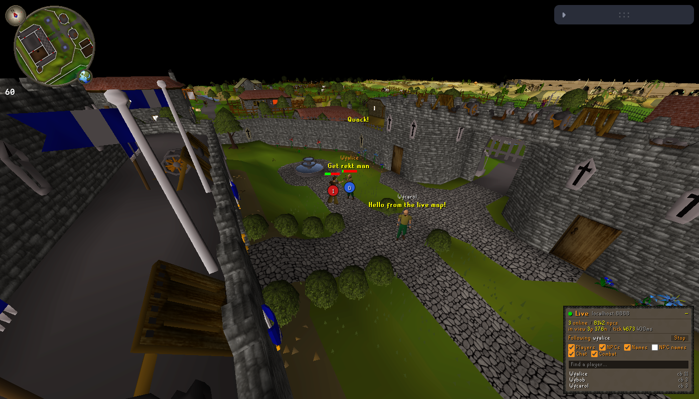

# RS World

A live 3D view of an [rs-sdk](https://github.com/MaxBittker/rs-sdk) game world. It renders the map from
the server's own cache and streams every player and npc from the engine as they move, fight, skill and talk.

It's a fork of dennisdev's [rs-map-viewer](https://github.com/dennisdev/rs-map-viewer), the viewer
behind [osrs.world](https://osrs.world). The terrain, locs and camera are theirs; the live layer is
new. See [DESIGN.md](DESIGN.md) for how it works.



## What you see

- **The world as the server packs it**: rev 289 terrain, locs and models from rs-sdk's cache.
- **Live players**: each player's real body (identity kits, colours and worn items), walking, running,
  combat and skilling animations, overhead chat, hitsplats and health bars.
- **Live npcs**: every npc in view with its server-side movement, animations, overhead text and combat.
- **Follow a player**: right-click a player → Follow, pick them in the Live panel, or open `?follow=<name>`.
  `[` and `]` (or Prev/Next in the panel) step to the previous and next player in the list.
  While following, drag (or the arrow keys) orbits the player and the wheel zooms; moving the camera
  (WASD, Q/E, right-drag) stops following. Otherwise the wheel flies the camera forward and back.
- **Pan**: right-drag slides the camera over the ground. A right click without dragging opens the menu.
- **World map**: every online player as a dot (white, your followed player orange). Click one to fly there.

## Running locally

You need an rs-sdk engine with its world feed turned on. The feed ships with rs-sdk and is off by
default.

```sh
# 1. Engine with the feed on (from an rs-sdk checkout)
cd ../rs-sdk/server/engine
WORLD_FEED=true EASY_STARTUP=true bun run src/app.ts

# 2. Install the engine's cache into caches/ (reads ../rs-sdk/server/engine/data/pack)
cd ../../../rs-world
yarn sync-cache

# 3. Viewer
yarn install --ignore-scripts   # sharp (texture export script only) doesn't build on new Node
yarn start                      # http://localhost:3000, feed defaults to ws://localhost:8888/worldfeed
```

To watch a remote server, sync its cache over HTTP and point the viewer at its feed:

```sh
yarn sync-cache --server https://rs-sdk-demo.fly.dev
# then open http://localhost:3000/?live=wss://rs-sdk-demo.fly.dev/worldfeed
```

That only works if that server runs with `WORLD_FEED=true`.

## URL parameters

| Param                  | Meaning                                                                     |
| ---------------------- | --------------------------------------------------------------------------- |
| `live=<ws url>`        | World feed to stream (URL-encode it if it carries `?token=`). `off` disables it. |
| `follow=<name>`        | Fly to a player and keep following them.                                    |
| `cx cy cz p y v=1`     | Camera position, pitch and yaw, same as osrs.world.                         |
| `cache=<name>`         | Cache from `caches/caches.json` (default: newest, i.e. `rs-sdk-289`).       |

The Live panel (bottom right) shows connection state, the online count and every player, 50 to a page. Info, under
it, credits the original viewer and links the repos. Render settings (top right) default to one step
brighter than the old client default and 1 rendered pixel per CSS pixel. Pick Native there for
full hi-dpi resolution.

## Deploying

Every push to `main` deploys to GitHub Pages at https://maxbittker.github.io/rs-world/
(`.github/workflows/pages.yml`). The workflow syncs the cache from `https://rs-sdk-demo.fly.dev` and
defaults the feed to `wss://rs-sdk-demo.fly.dev/worldfeed`. Set the `RS_SDK_SERVER` and
`WORLD_FEED_URL` repository variables to point it elsewhere.

Elsewhere, `yarn build` gives a static site. Copy `caches/` to `build/caches/` and host the result with:

- `Cross-Origin-Opener-Policy: same-origin` and `Cross-Origin-Embedder-Policy: require-corp`.
  The viewer shares cache buffers with its workers (`SharedArrayBuffer`). `public/_headers` sets
  both on Cloudflare Pages and Netlify. Hosts that can't set headers (like GitHub Pages) fall back
  to `public/coi-serviceworker.js`, which adds them from a service worker and reloads once.
- `REACT_APP_WORLD_FEED_URL=wss://<server>/worldfeed` at build time, so the live layer has a default
  off localhost.
- `PUBLIC_URL=/<path>` at build time when the site isn't served from the domain root.

On the engine side, see the deployment notes in [DESIGN.md](DESIGN.md#deploying-the-feed).

## Credits

- [rs-map-viewer](https://github.com/dennisdev/rs-map-viewer) by dennisdev (BSD 2-Clause), which
  credits Jagex, RuneLite, the OpenRS2 Archive, the RuneScape Archive, the OSRS Wiki, 2004scape,
  2009scape, RuneStar, Blurite and the RuneApps Model Viewer
- [rs-sdk](https://github.com/MaxBittker/rs-sdk) and [LostCity](https://github.com/LostCityRS) (MIT):
  the engine, the cache, and the client logic the live layer ports
